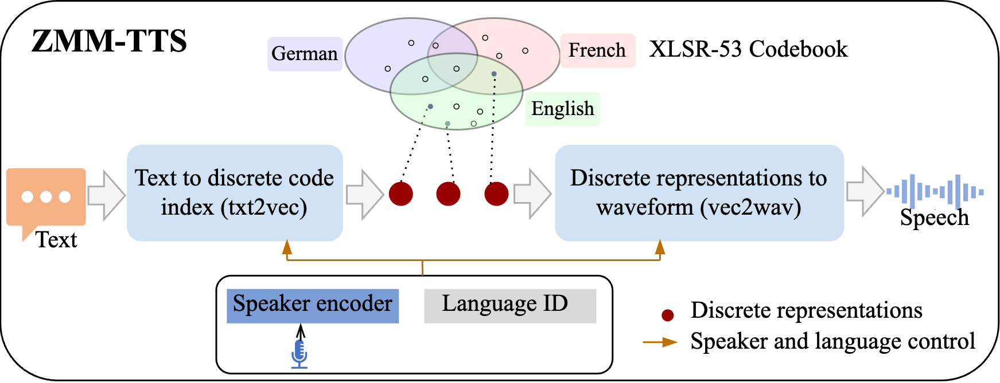

# ZMM-TTS: Zero-shot Multilingual and Multispeaker Speech Synthesis Conditioned on Self-supervised Discrete Speech Representations

<a href='https://gongchenghhu.github.io/TASLP-demo/'></a>  <a href='https://arxiv.org/abs/2312.14398'></a>

## Introduction
This is the code for the ZMM-TTS submitted to the [IEEE TASLP](https://arxiv.org/abs/2312.14398). This paper presents ZMM-TTS, a multilingual and multispeaker framework utilizing quantized latent speech representations from a large-scale, pre-trained, self-supervised model. Our paper is the first to incorporate the representations from text-based and speech-based self-supervised learning models into multilingual speech synthesis tasks. We conducted comprehensive subjective and objective evaluations through a series of experiments. Our model has been proven effective in terms of speech naturalness and similarity for both seen and unseen speakers in six high-resource languages. We also tested the efficiency of our method on two hypothetical low-resource languages. The results are promising, indicating that our proposed approach can synthesize audio that is intelligible and has a high degree of similarity to the target speaker's voice, even without any training data for the new, unseen language. 

<br>
<p align="center">
     <br>
    Overview
</p>
<be>

Welcome to try our code and pre-trained model on different languages!

## Release 
- [20/01] 🔥 We released code and model pre-trained on 6 language (English, French, German, Portuguese, Spanish and Swedish) public datasets.

## Samples
Samples are provided on [our demo page](https://gongchenghhu.github.io/TASLP-demo/).

## Installation

ZMM-TTS requires Python>=3.8, and a reasonly recent version of PyTorch.
To install ZMM-TTS and make a quick synthesis, you can run from this repository:
```bash
git clone https://github.com/nii-yamagishilab-visitors/ZMM-TTS.git

cd ZMM-TTS
pip3 install -r requirements.txt
#In addition, you may need to install these libraries to support full functionality.
pip install transformers  #For support XLSR-53 and XphoneBERT model.
pip install speechbrain   #For extracting speaker embedding.
```
If you want to try IPA representations, you need to install [Epitran](https://github.com/dmort27/epitran).

## Pre-trained self-supervised model
|Model| Modality| Lang| Training data|
|:----|:----:|:----|:----|
|[XLSR-53](https://huggingface.co/facebook/wav2vec2-large-xlsr-53)| Audio| 53 |56K hours|
|[ECAPA-TDNN](https://huggingface.co/speechbrain/spkrec-ecapa-voxceleb)| Audio| > 5| 2794 hours|
|[XPhoneBERT](https://huggingface.co/vinai/xphonebert-base)| Text| 94| 330M sentences|
## Usage
### Prepapre multilingual multispeaker dataset MM6
In my paper, the training data we used contained [GlobalPhone](https://ieeexplore.ieee.org/document/6639248), and unfortunately that is not an open source data. 
Considering the scarcity of publicly multilingual and multilingual speaker databases for speech synthesis, I designed the following training database based on the [MLS](https://www.openslr.org/94/) and [NHT Swedish](https://huggingface.co/datasets/jimregan/nst_swedish_tts) databases and called it MM6. (It seems that NST is no longer open for downloads in Swedish, in which case you will not have to consider Swedish.) If you have GlobalPhone dataset, you can try the same training data `Dataset/train_paper.txt` as our paper.
|Language|Gender|Speakers|Sentences|Durations (h)|Database|
|:----|:----|:----|:----|:----|:----|
|English|Female|20|4000|13.9|MLS|
|English|Male|20|4000|13.9|MLS|
|French|Female|20|4000|13.9|MLS|
|French|Male|20|4000|13.9|MLS|
|German|Female|20|4000|13.9|MLS|
|German|Male|20|4000|13.9|MLS|
|Portuguese|Female|16|3741|13.0|MLS|
|Portuguese|Male|20|4175|14.5|MLS|
|Spanish|Female|20|3519|12.2|MLS|
|Spanish|Male|20|3786|13.1|MLS|
|Swedish|Female|0|0|0||
|Swedish|Male|20|4000|13.9|NST|

Once the MLS and NST Swedish data have been downloaded, the following script can be executed to generate the MM6 dataset:
```bash
python prepare_data/creat_meta_data.py

#We recommend that you use sv56 to normalize the audio.
bash scripts/norm_wav.sh
#
```
This MM6 is a multilingual dataset with a largely balanced mix of speakers and genders, and we encourage you to experiment with other tasks as well.
### Preprocess
After you generate the MM6 dataset, you can find wav in `Dataset/MM6/wavs/`  and meta file in `Dataset/preprocessed_data/ZMM6/train.txt`.
The meta file looks like:
```bash
Name|Database|Language|Speaker|text
7756_9025_000004|MM6|English|7756|on tiptoe also i followed him and just as his hands were on the wardrobe door my hands were on his throat he was a little man and no match for me
```
1. Extract discrete code index and representations:
```bash
bash scripts/extract_discrete.sh
```
2. Extract speaker embeddings:
```bash
bash scripts/extract_spk.sh
```
3. Extract text sequences:
```bash
python prepare_data/extract_text_seq_from_raw_text.py
```
4. Extract mel spectrograms:
```bash
python prepare_data/compute_mel.py
```
5. Compute a priori alignment probabilities：
```bash
python prepare_data/compute_attention_prior.py
```
### Train model
1. Train txt2vec model:
```bash
#Using XphoneBERT:
python txte2vec/train.py --dataset MM6 --config MM6_XphoneBERT
#Using Characters (Letters):
python txte2vec/train.py --dataset MM6 --config MM6_Letters
#Using IPA:
python txte2vec/train.py --dataset MM6 --config MM6_IPA

#If you want to train a model without a language layer, you could use xxx_wo config like:
python txte2vec/train.py --dataset MM6 --config MM6_XphoneBERT_wo
```
2. Train vec2mel model:
```bash
python vec2mel/train.py --dataset MM6 --config MM6
```
3. Train vec2wav model:
```bash
python vec2wav/train.py -c Config/vec2wav/vec2wav.yaml

#If you want to train a model without a language layer:
python vec2wav/train.py -c Config/vec2wav/vec2wav_wo.yaml
```
4. Train HifiGAN model:
``` bash
python Vocoder_HifiGAN_Model/train.py --config Config/config_16k_mel.json
```
### Test model
1. Prepare test data:
   a. test meta file `Dataset/MM6/test.txt`.
   b. ref speaker embedding in `Dataset/MM6/test_spk_emb/`.
2. Generate sample
   ``` bash
   bash test_scripts/quick_test.sh
   ```
3. The result would be found in `test_result` files.

## To do
- [x] Scripts for few-shot training.
- [x] Scripts for zero-shot inference on any language.

## Citation
If you use this code, result, or MM6 dataset in your paper, please cite our work as:
```Tex
@article{gong2023zmm,
  title={ZMM-TTS: Zero-shot Multilingual and Multispeaker Speech Synthesis Conditioned on Self-supervised Discrete Speech Representations},
  author={Gong, Cheng and Wang, Xin and Cooper, Erica and Wells, Dan and Wang, Longbiao and Dang, Jianwu and Richmond, Korin and Yamagishi, Junichi},
  journal={arXiv preprint arXiv:2312.14398},
  year={2023}
}
```
# References
-  [Comprehensive-Transformer-TTS](https://github.com/keonlee9420/Comprehensive-Transformer-TTS), the txt2vec and vec2mel model were built on this project.
-  [XPhoneBERT](https://github.com/VinAIResearch/XPhoneBERT), a Pre-trained Multilingual Model for Phoneme Representations for Text-to-Speech.
-  [MSMC-TTS](https://github.com/hhguo/MSMC-TTS), the vec2wav model was built on this project.
-  [HifiGAN](https://github.com/jik876/hifi-gan), Vocoder.
-  [wav2vec2-codebook-indices](https://github.com/fauxneticien/wav2vec2-codebook-indices)The scripts for extracting the discrete code index and representations. 
## License
The code in this repository is released under the BSD-3-Clause license as found in the LICENSE file.
The `txt2vec`, `vec2mel` and `vec2wav` subfolder have MIT License. 
The sv56scripts has GPL License.

